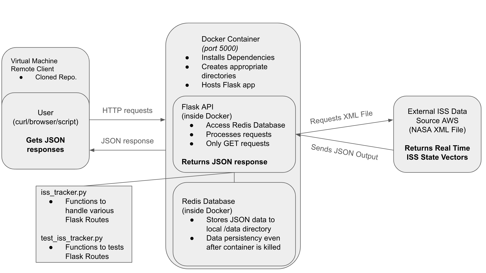

# ISS Tracker API with Flask, Redis, and Docker-Compose

A Flask-based API that tracks the International Space Station (ISS) in real-time by fetching state vector data from NASA. The API returns positional and velocity details and computes instantaneous speed and geolocation data for given epochs.

---

## Application Architecture


## Data Source
The ISS state vector data is obtained from NASA's public dataset:  
🔗 [NASA ISS Data](https://spotthestation.nasa.gov/trajectory_data.cfm)

---

## Deployment with Docker Compose

### 1. Clone the Repository
```bash
git clone https://github.com/mintChocolate717/iss_tracker.git
cd iss_tracker
```

### 2. Launch the Application
Use Docker Compose to build and run the containers (Redis and Flask API):
```bash
docker-compose up --build -d
```
The API will be accessible at: **http://127.0.0.1:5000/**

---

## API Endpoints and Usage

### 1. Retrieve All ISS State Vectors
- **Endpoint:** `GET /epochs`
- **Description:** Returns a list of ISS state vectors. Optional query parameters:
  - **`limit`**: Maximum number of records (e.g., `limit=5`)
  - **`offset`**: Number of records to skip (e.g., `offset=2`)
- **Example:**
  ```bash
  curl http://127.0.0.1:5000/epochs
  curl "http://127.0.0.1:5000/epochs?limit=5&offset=2"
  ```

---

### 2. Retrieve Data for a Specific Epoch
- **Endpoint:** `GET /epochs/<epoch>`
- **Description:** Returns the state vector for the specified epoch.
- **Example:**
  ```bash
  curl http://127.0.0.1:5000/epochs/2025-063T12:00:00.000Z
  ```
- **Note:** An error message is returned if the epoch does not exist.

---

### 3. Retrieve Closest ISS Data to Current Time
- **Endpoint:** `GET /now`
- **Description:** Finds the ISS state vector closest to the current UTC time and returns its instantaneous speed along with geolocation details.
- **Example:**
  ```bash
  curl http://127.0.0.1:5000/now
  ```
- **Expected Output (example):**
  ```json
  {
      "now_EPOCH": "2025-063T12:00:00.000Z",
      "now_speed": 7.43,
      "now_latitude": 42.0,
      "now_longitude": -71.0,
      "now_altitude": 408.0,
      "now_Nearest_Geolocaiton": "Cambridge, MA, USA"
  }
  ```

---

### 4. Compute ISS Speed for a Specific Epoch
- **Endpoint:** `GET /epochs/<epoch>/speed`
- **Description:** Computes the instantaneous speed at the given epoch using the formula:
  $$
  \text{Speed} = \sqrt{X_{DOT}^2 + Y_{DOT}^2 + Z_{DOT}^2}
  $$
- **Example:**
  ```bash
  curl http://127.0.0.1:5000/epochs/2025-063T12:00:00.000Z/speed
  ```
- **Expected Output (example):**
  ```json
  {
      "EPOCH": "2025-063T12:00:00.000Z",
      "Instantaneous_Speed": 7.43
  }
  ```

---

### 5. Retrieve ISS Geolocation Data for a Specific Epoch
- **Endpoint:** `GET /epochs/<epoch>/location`
- **Description:** Returns the geographic location (latitude, longitude, altitude) and the nearest named location for the specified epoch.
- **Example:**
  ```bash
  curl http://127.0.0.1:5000/epochs/2025-063T12:00:00.000Z/location
  ```
- **Expected Output (example):**
  ```json
  {
      "latitude": 42.0,
      "longitude": -71.0,
      "altitude": 408.0,
      "Nearest_Geolocation": "Cambridge, MA, USA"
  }
  ```

---

## Running Containerized Unit Tests

The project includes unit tests (using `pytest`) to verify API functionality.
Make sure the docker is running before running the tests.

### Run the Tests in the Running Container
```bash
pytest test_iss_tracker.py
```
- **Expected Output (example):**
  ```bash
  ============================= test session starts ==============================
  collected 12 items
  
  test_iss_tracker.py .........                                          [100%]
  
  ============================== 12 passed in 0.15s ===============================
  ```
---

## Ending the application
When you are done, make sure to remove the running containers.

```bash
docker-compose down
```


## Project Structure
```
.
├── Dockerfile              # Docker configuration for building the Flask API container
├── docker-compose.yml      # Docker Compose configuration for Redis and Flask API services
├── requirements.txt        # Project dependencies
├── iss_tracker.py          # Main Flask API application
├── test_iss_tracker.py     # Unit tests for the API using pytest
├── diagram.png             # Diagram illustrating API interactions and architecture
└── README.md               # Project documentation (this file)
```

---

## Additional Notes
- The API fetches live ISS data on each request. Ensure you have an active internet connection.
- The Redis database caches ISS data; if empty, it is populated on demand.
- All error conditions (such as invalid epochs or query parameters) return descriptive error messages.

Happy tracking the ISS!
```
